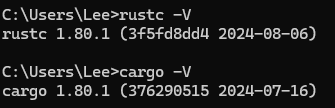
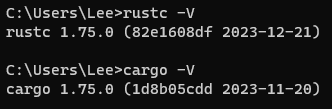
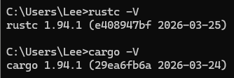

# Getting Started

## Installation

**_Rustup: the Rust installer and version management tool_**

```bash
# check installation
rustc --version
cargo --version
# or
rustc -V
cargo -V

# update rust
rustup update

# uninstall rust
rustup self uninstall

# open local doc
rustup docs --book
```







## Development Environment

- VS Code + (plugin: rust-analyzer) 👍
- RustRover (by JetBrains)

## Hello World!

`hello_world.rs`

```rust
fn main() {
    println!("Hello, world!");
}
```

`rustc`

```bash
# compile
rustc ./hello_world.rs

# run
./hello_world

# windows
.\hello_world.exe
```

## Package Management

**_Cargo: the Rust build tool and package manager_**

```bash
cargo --version

cargo new hello_cargo
# init without git
cargo new hello_cargo --vcs none

# build in debug mode
cargo build

# build and run
cargo run

# test your code
cargo test

# checks your code to catch errors without producing an executable binary
cargo check

# build in release mode(for production)
cargo build --release

# update the dependencies to the latest versions allowed by cargo.toml
cargo update

# build documentation for your project
cargo doc --open

# publish a library to crates.io
cargo publish
```

- cargo doc: [https://doc.rust-lang.org/cargo/](https://doc.rust-lang.org/cargo/)
- official crate registry：[https://crates.io/](https://crates.io/)
- configuration file: `Cargo.toml`, just like `package.json`
- version control: `Cargo.lock`, just like `package-lock.json`
- Semantic Versioning: [https://semver.org/](https://semver.org/)
