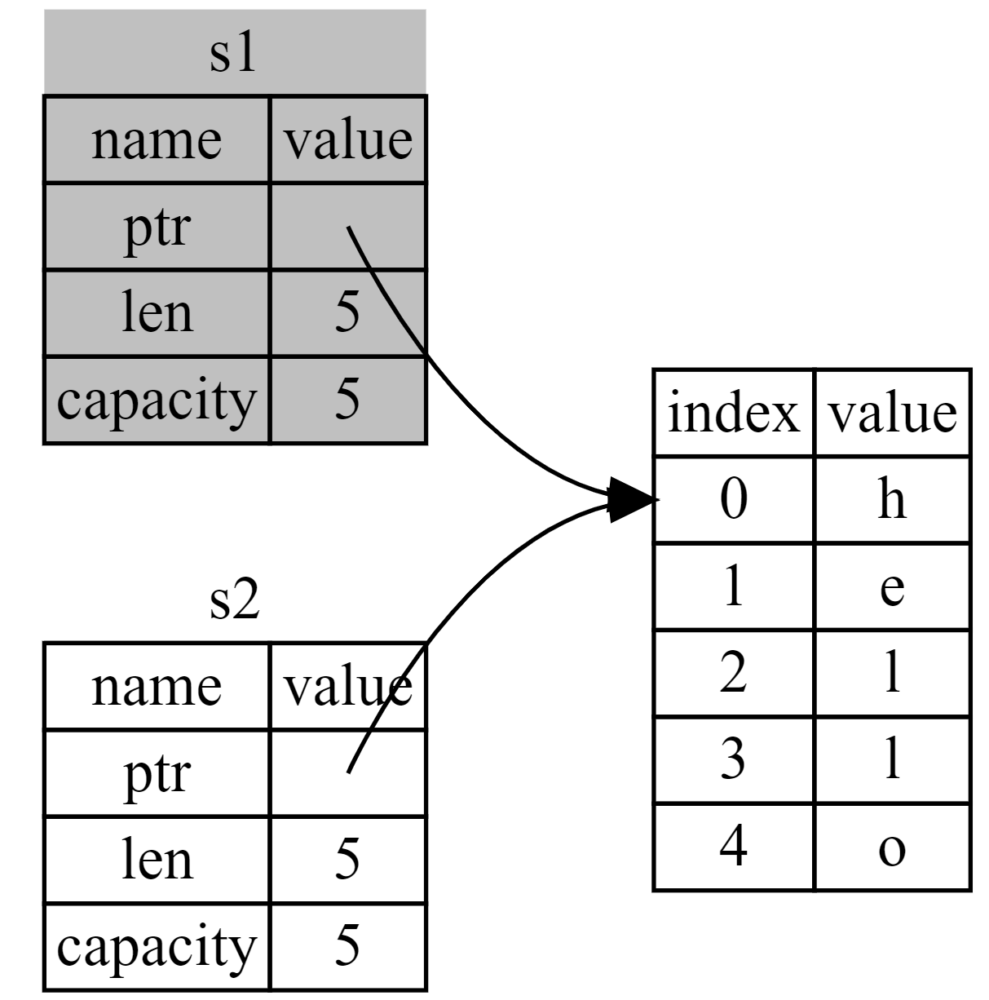
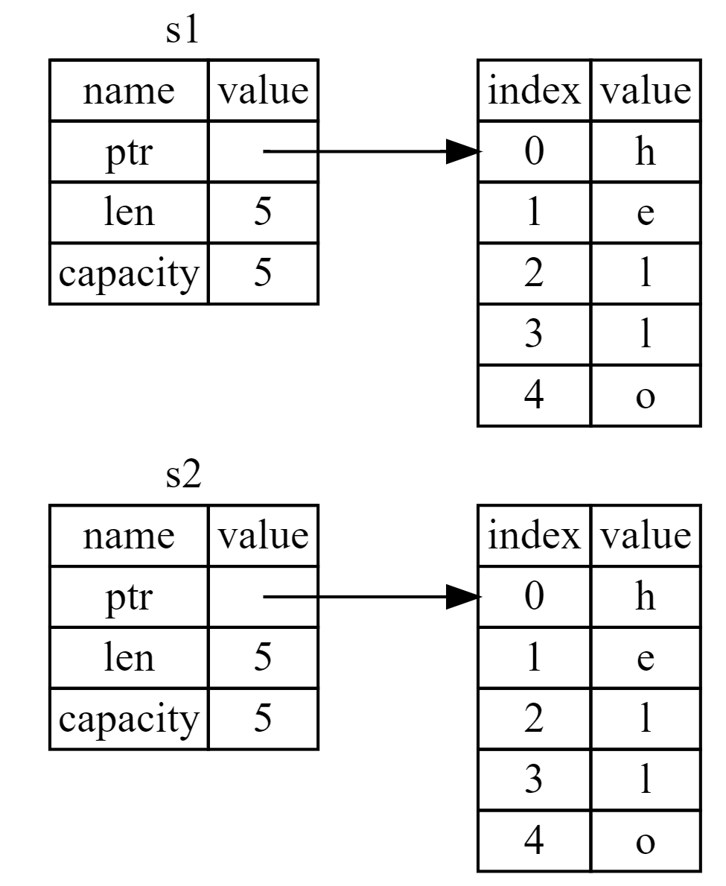
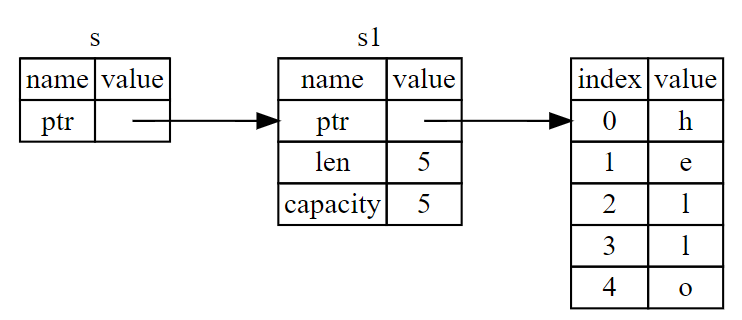
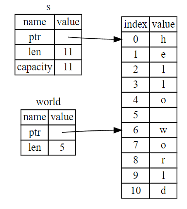

# Rust - Ownership

## What Is Ownership?

> *Ownership* is a set of rules that govern how a Rust program manages memory.
> 

### how to use a computer’s memory

| Approach                                                     | Languages                        |
| ------------------------------------------------------------ | -------------------------------- |
| garbage collection that regularly looks for no-longer-used memory | Java、Kotlin、JavaScript、Python |
| explicitly allocate and free the memory                      | C/C++                            |

### The Stack and the Heap

- *last in, first out*
- *pushing onto the stack*
- *popping off the stack*
- memory allocator
- *allocating on the heap*

## Ownership Rules

- Each value in Rust has an *owner*. Rust中的每一个值都有一个对应的变量作为它的所有者。
- There can only be one owner at a time. 在同一时间内，值有且仅有一个所有者。
- When the owner goes out of scope, the value will be dropped. 当所有者离开自己的作用域时，它持有的值就会被释放掉。

### Variable Scope

```rust
fn main() {
    {                      // s is not valid here, it’s not yet declared
        let s = "hello";   // s is valid from this point forward

        // do stuff with s
    }                      // this scope is now over, and s is no longer valid
}
```

### Memory and Allocation

```rust
fn main() {
    {
        let s = String::from("hello"); // s is valid from this point forward

        // do stuff with s
    }                                  // this scope is now over, and s is no
                                       // longer valid
}
```

There is a natural point at which we can return the memory our `String` needs to the allocator: when `s` goes out of scope. When a variable goes out of scope, Rust calls a special function for us. This function is called [`drop`](https://doc.rust-lang.org/stable/std/ops/trait.Drop.html#tymethod.drop), and it’s where the author of `String` can put the code to return the memory. Rust calls `drop` automatically at the closing curly bracket.

## Variables and Data Interacting with Move

```rust
fn main() {
    let s1 = String::from("hello");
    // s1 was moved into s2
    let s2 = s1;

    println!("{s1}, world!"); // error! s1 as no longer valid.
}
```



## Variables and Data Interacting with Clone

```rust
fn main() {
    let s1 = String::from("hello");
    let s2 = s1.clone();

    println!("s1 = {s1}, s2 = {s2}");
}
```



## Stack-Only Data: Copy

```rust
fn main() {
    let x = 5;
    let y = x;

    println!("x = {x}, y = {y}");
}
```

- If a type implements the `Copy` trait, variables that use it do not move, but rather are trivially copied, making them still valid after assignment to another variable.
- Rust won’t let us annotate a type with `Copy` if the type, or any of its parts, has implemented the `Drop` trait.
- some of the types that implement `Copy`:
    - All the integer types, such as `u32`.
    - The Boolean type, `bool`, with values `true` and `false`.
    - All the floating-point types, such as `f64`.
    - The character type, `char`.
    - Tuples, if they only contain types that also implement `Copy`. For example, `(i32, i32)` implements `Copy`, but `(i32, String)` does not.

## Ownership and Functions

```rust
fn main() {
    let s = String::from("hello");  // s comes into scope

    takes_ownership(s);             // s's value moves into the function...
                                    // ... and so is no longer valid here

    let x = 5;                      // x comes into scope

    makes_copy(x);                  // x would move into the function,
                                    // but i32 is Copy, so it's okay to still
                                    // use x afterward

} // Here, x goes out of scope, then s. But because s's value was moved, nothing
  // special happens.

fn takes_ownership(some_string: String) { // some_string comes into scope
    println!("{some_string}");
} // Here, some_string goes out of scope and `drop` is called. The backing
  // memory is freed.

fn makes_copy(some_integer: i32) { // some_integer comes into scope
    println!("{some_integer}");
} // Here, some_integer goes out of scope. Nothing special happens.
```

### Return Values and Scope

```rust
fn main() {
    let s1 = gives_ownership();         // gives_ownership moves its return
                                        // value into s1

    let s2 = String::from("hello");     // s2 comes into scope

    let s3 = takes_and_gives_back(s2);  // s2 is moved into
                                        // takes_and_gives_back, which also
                                        // moves its return value into s3
} // Here, s3 goes out of scope and is dropped. s2 was moved, so nothing
  // happens. s1 goes out of scope and is dropped.

fn gives_ownership() -> String {             // gives_ownership will move its
                                             // return value into the function
                                             // that calls it

    let some_string = String::from("yours"); // some_string comes into scope

    some_string                              // some_string is returned and
                                             // moves out to the calling
                                             // function
}

// This function takes a String and returns one
fn takes_and_gives_back(a_string: String) -> String { // a_string comes into
                                                      // scope

    a_string  // a_string is returned and moves out to the calling function
}
```

```rust
fn main() {
    let s1 = String::from("hello");

    let (s2, len) = calculate_length(s1);

    println!("The length of '{s2}' is {len}.");
}

fn calculate_length(s: String) -> (String, usize) {
    let length = s.len(); // len() returns the length of a String

    (s, length)
}
```

While this works, taking ownership and then returning ownership with every function is a bit tedious. What if we want to let a function use a value but not take ownership? It’s quite annoying that anything we pass in also needs to be passed back if we want to use it again, in addition to any data resulting from the body of the function that we might want to return as well.

Luckily for us, Rust has a feature for using a value without transferring ownership, called ***references***.

## borrowing

> We call the action of creating a reference *borrowing*.
> 

```rust
fn main() {
    let s1 = String::from("hello");

    let len = calculate_length(&s1);

    println!("The length of '{s1}' is {len}.");
}

fn calculate_length(s: &String) -> usize { // s is a reference to a String
    s.len()
} // Here, s goes out of scope. But because it does not have ownership of what
  // it refers to, it is not dropped.
```



## Mutable References

```rust
fn main() {
    let s = String::from("hello");

    change(&s);
}

fn change(some_string: &String) {
    some_string.push_str(", world"); // error! Attempting to modify a borrowed value
}
```

```rust
fn main() {
    let mut s = String::from("hello");

    change(&mut s);
}

fn change(some_string: &mut String) {
    some_string.push_str(", world");
}
```

- if you have a mutable reference to a value, you can have no other references to that value.

```rust
fn main() {
    let mut s = String::from("hello");

    let r1 = &mut s;
    let r2 = &mut s; // error! cannot borrow `s` as mutable more than once at a time

    println!("{}, {}", r1, r2);
}
```

The benefit of having this restriction is that Rust can prevent data races at compile time.

A *data race* is similar to a race condition and happens when these three behaviors occur:

- Two or more pointers access the same data at the same time.
- At least one of the pointers is being used to write to the data.
- There’s no mechanism being used to synchronize access to the data.

we can use curly brackets to create a new scope, allowing for multiple mutable references, just not *simultaneous* ones:

```rust
fn main() {
    let mut s = String::from("hello");

    {
        let r1 = &mut s;
    } // r1 goes out of scope here, so we can make a new reference with no problems.

    let r2 = &mut s;
}
```

We *also* cannot have a mutable reference while we have an immutable one to the same value.
Users of an immutable reference don’t expect the value to suddenly change out from under them!

However, multiple immutable references are allowed because no one who is just reading the data has the ability to affect anyone else’s reading of the data.

```rust
fn main() {
    let mut s = String::from("hello");

    let r1 = &s; // no problem
    let r2 = &s; // no problem
    let r3 = &mut s; // BIG PROBLEM

    println!("{}, {}, and {}", r1, r2, r3);
}
```

**Note that a reference’s scope starts from where it is introduced and continues through the last time that reference is used.**

```rust
fn main() {
    let mut s = String::from("hello");

    let r1 = &s; // no problem
    let r2 = &s; // no problem
    println!("{r1} and {r2}");
    // variables r1 and r2 will not be used after this point

    let r3 = &mut s; // no problem
    println!("{r3}");
}
```

## Dangling References

```rust
fn main() {
    let reference_to_nothing = dangle();
}

fn dangle() -> &String { // dangle returns a reference to a String

    let s = String::from("hello"); // s is a new String

    &s // we return a reference to the String, s
} // Here, s goes out of scope, and is dropped. Its memory goes away.
  // Danger!
```

```rust
fn main() {
    let string = no_dangle();
}

fn no_dangle() -> String {
    let s = String::from("hello");

    s
}
```

## The Rules of References

- At any given time, you can have *either* one mutable reference *or* any number of immutable references.
- References must always be valid.

## The Slice Type

> *Slices* let you reference a contiguous sequence of elements in a [collection](https://doc.rust-lang.org/stable/book/ch08-00-common-collections.html) rather than the whole collection. A slice is a kind of reference, so it does not have ownership.
> 

```rust
fn main() {
    let s = String::from("hello world");

    let hello = &s[0..5];
    let world = &s[6..11];
}
```



```rust
fn main() {
    let mut s = String::from("hello world");

    let word = first_word(&s);

    s.clear(); // error！

    println!("the first word is: {}", word);
}

fn first_word(s: &String) -> &str {
    let bytes = s.as_bytes();

    for (i, &item) in bytes.iter().enumerate() {
        if item == b' ' {
            return &s[0..i];
        }
    }

    &s[..]
}
```

### String Literals as Slices

The type of `s` here is `&str`: it’s a slice pointing to that specific point of the binary. This is also why string literals are immutable; `&str` is an immutable reference.

```rust
let s = "Hello, world!";
```

### String Slices as Parameters

```rust
fn first_word(s: &str) -> &str {
```

```rust
fn main() {
    let my_string = String::from("hello world");

    // `first_word` works on slices of `String`s, whether partial or whole
    let word = first_word(&my_string[0..6]);
    let word = first_word(&my_string[..]);
    // `first_word` also works on references to `String`s, which are equivalent
    // to whole slices of `String`s
    let word = first_word(&my_string);

    let my_string_literal = "hello world";

    // `first_word` works on slices of string literals, whether partial or whole
    let word = first_word(&my_string_literal[0..6]);
    let word = first_word(&my_string_literal[..]);

    // Because string literals *are* string slices already,
    // this works too, without the slice syntax!
    let word = first_word(my_string_literal);
}
```

## Other Slices

```rust
#![allow(unused)]
fn main() {
    let a = [1, 2, 3, 4, 5];
    let slice = &a[1..3];
    assert_eq!(slice, &[2, 3]);
}
```
